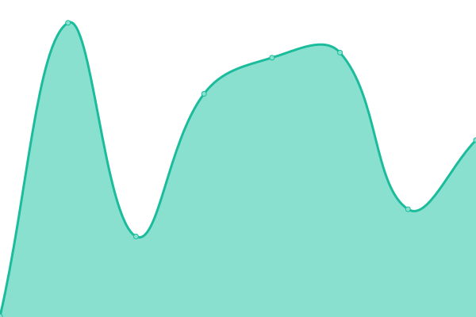

# [📈 Live Status](https://uptime.ani.work): <!--live status--> **🟩 All systems operational**

This repository contains the open-source uptime monitor and status page for [Elysia Root L.C.](https://uptime.ani.work), powered by [Upptime](https://github.com/upptime/upptime).

With [Upptime](https://upptime.js.org), you can get your own unlimited and free uptime monitor and status page, powered entirely by a GitHub repository. We use [Issues](https://github.com/elysiaroot/aniwork-uptime/issues) as incident reports, [Actions](https://github.com/elysiaroot/aniwork-uptime/actions) as uptime monitors, and [Pages](https://uptime.ani.work) for the status page.

<!--start: status pages-->
<!-- This summary is generated by Upptime (https://github.com/upptime/upptime) -->
<!-- Do not edit this manually, your changes will be overwritten -->
<!-- prettier-ignore -->
| URL | Status | History | Response Time | Uptime |
| --- | ------ | ------- | ------------- | ------ |
|  [Aniwork Network](https://ani.work/) | 🟩 Up | [aniwork-network.yml](https://github.com/elysiaroot/aniwork-uptime/commits/HEAD/history/aniwork-network.yml) | 

 307ms
     
 | 

<a href="https://uptime.ani.work/history/aniwork-network">100.00%</a>
    

|  [Image-CDN](https://cdn.ani.work/media_attachments/files/109/368/607/400/125/411/original/073fc528ace47db4.png) | 🟩 Up | [image-cdn.yml](https://github.com/elysiaroot/aniwork-uptime/commits/HEAD/history/image-cdn.yml) | 

 479ms
     
 | 

<a href="https://uptime.ani.work/history/image-cdn">100.00%</a>
    

|  [Aniwork Relay](https://relay.ani.work) | 🟩 Up | [aniwork-relay.yml](https://github.com/elysiaroot/aniwork-uptime/commits/HEAD/history/aniwork-relay.yml) | 

 412ms
     
 | 

<a href="https://uptime.ani.work/history/aniwork-relay">100.00%</a>
    

<!--end: status pages-->

[**Visit our status website →**](https://uptime.ani.work)

## 📄 License

- Powered by: [Upptime](https://github.com/upptime/upptime)
- Code: [MIT](./LICENSE) © [Elysia Root L.C.](https://uptime.ani.work)
- Data in the `./history` directory: [Open Database License](https://opendatacommons.org/licenses/odbl/1-0/)
